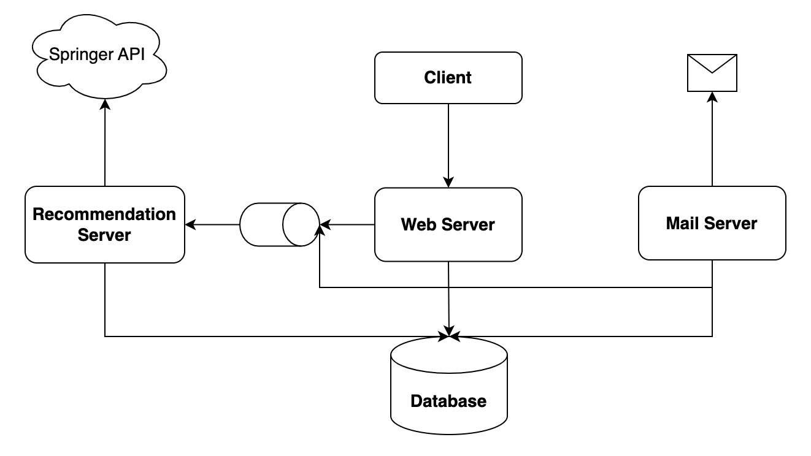

# **ScholarLink**

<details>
  <summary>Table of Contents</summary>
  <ol>
    <li>
      <a href="#about-the-project">About The Project</a>
      <ul>
        <li><a href="#features">Features</a></li>
      </ul>
      <ul>
        <li><a href="#built-with">Built With</a></li>
      </ul>
      <ul>
        <li><a href="#system-design">System Design</a></li>
      </ul>
    </li>
    <li>
      <a href="#getting-started">Getting Started</a>
      <ul>
        <li><a href="#prerequisites">Prerequisites</a></li>
        <li><a href="#instruction">Instruction</a></li>
      </ul>
    </li>
    <li><a href="#license">License</a></li>
    <li><a href="#contact">Contact</a></li>
  </ol>
</details>

## About The Project  

<p align="center"> 
    
</p>

ScholarLink is a web application that provides personalized weekly research paper recommendations to subscribed users based on their specified interests.

### Features

* Subscribe 
* Unsubscribe 
* Provide interests
* Fetch previous interests
* Subscribers will receive weekly research paper recommendations via email, tailored to their interests

<p align="right">(<a href="#top">back to top</a>)</p>

### Built With

* React, Node, Express, MongoDB, JavaScript, Python, RabbitMQ, Docker, Springer API

<p align="right">(<a href="#top">back to top</a>)</p>

### System Design

<p align="center"> 
    
</p>

<p align="right">(<a href="#top">back to top</a>)</p>

## Getting Started
### Prerequisites

1. Get a free API Key at [https://dev.springernature.com/](https://dev.springernature.com/) for **Instruction section 2.recommender**
2. Follow the [instructions](https://www.freecodecamp.org/news/use-nodemailer-to-send-emails-from-your-node-js-server/#:~:text=To%20create%20a%20transporter%20object%2C%20we%20do%20the%20following%3A) to get the credentials for SMTP transporter with Nodemailer for **Instruction section 2.mail**

<p align="right">(<a href="#top">back to top</a>)</p>

### Instruction
1. Clone the repo
   ```sh
   git clone https://github.com/Hsin-Hung/ScholarLink.git
   ```
2. Set up the environment variables by creating an `.env` file in each of the following directories with the specified keys:
   * recommender
        ```
            API_KEY=<your Springer API key>
        ```
   * mail
        ```
            MAIL_USERNAME=<your email username>
            MAIL_PASSWORD=<your email password>
            OAUTH_CLIENTID=<your oauth cliend id>
            OAUTH_CLIENT_SECRET=<your oauth client secret>
            OAUTH_REFRESH_TOKEN=<your oauth refresh token>
        ```
3. Configurations (Optional): 
   * [node-cron](https://www.npmjs.com/package/node-cron) (docker-compose)
    ```js
        // Set to "*/30 * * * * *" to schedule mail every 30 secs for testing
        CRON_SCHEDULE: "0 17 * * 5" // Default schedules weekly mail every 17:00 Fri
    ```

4. Run and access the web app through port 8080
   ```sh
   docker compose up
   ```

<p align="right">(<a href="#top">back to top</a>)</p>

## License

Distributed under Apache-2.0 license. See `LICENSE` for more information.

<p align="right">(<a href="#top">back to top</a>)</p>

## Contact

Henry - hsinhungw@gmail.com

Hackathon Link: [HackSharks](https://hacksharks.devpost.com/)

<p align="right">(<a href="#top">back to top</a>)</p>
